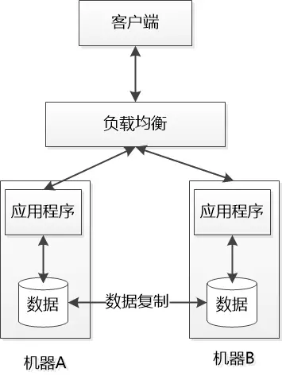

## 张大胖和CAP定理

原创： 刘欣 [码农翻身](javascript:void(0);) *2017-03-13*

计算机界有很多高大上又难于理解的术语，CAP就是其中之一， 什么一致性（Consistency）， 可用性（Availability）， 分区容错性（Partition tolerance） 就很难理解了，  再加上**CAP定理**更是让人云里雾里，  今天咱们试图通俗的演绎一下。

张大胖在公司奋发图强，经过多年的努力，终于做到了架构师的位置。

架构师的椅子还没坐热，很快就来了一个项目要做架构设计。

老板把大胖叫来，谆谆教导说： 大胖啊， 数据是我们的宝贵资产，你设计的系统可千万要保证数据不能丢失啊！

大胖说老板放心， 这方面我有经验， 一般来讲我们要做数据的冗余处理， 简单的来讲就是给数据做多个副本来保存。 我会设计一个分布式系统， 把数据备份到多个机器节点去。

几天后， 大胖给发了一张图， 展示了这个分布式系统是怎么工作的：

数据副本在不同的机器上做冗余， 中间有数据的复制， 保证数据的同步。

虽然只是两台机器， 但是也构成了一个简单的分布式环境。

老板虽然不懂技术， 但是看到数据在不同的机器之间有备份，也就放心了。

经过几个月的开发和测试，系统顺利上线， 但是大家很快就发现：  分布式系统不像单机系统那么简单， 由于网络的原因， 或者某个机器的原因很容易导致通讯失败，或者节点不可用。

有一天， 用户先访问了左边的机器A , 写入了一条数据，  然后机器A很不幸， 网线被悲催的网管给踢掉了， 这直接导致了两个严重的后果：

\1. 负载均衡找不着机器A，认为它死翘翘了， 就要把用户的下一次访问转到机器B去。

\2. 数据复制也找不着机器A  ,  只好罢工。 用户刚写入的数据没法复制到机器B，机器B上还是老数据

怎么办？   虽然这是一次偶然， 把网管臭骂一顿， 插上网线就可以了， 但是谁能保证以后两个机器的通信是一致畅通的呢？

组里的小王说：    我们的机器B 还活着呢， 还能提供服务， 数据复制不到机器B， 不就是少看几条数据嘛， 无伤大雅，不影响大局， 勉强可用， 插上网线后数据复制就会工作， 一切就会恢复正常。

小王无意中选择了系统的**可用性(Availability，简称A)**， 系统能提供服务就好， 数据不一致可以忍受。

张大胖说:  不行，  老板说了，我们系统的数据极为重要， 数据如果不一致会带来严重后果，所以机器B上的和这些关键数据相关的功能也必须停掉， 必须等到机器A插上网线，数据同步以后才能开工

很明显， 张大胖遵循老板指示， 把**一致性（Consistency, 简称C ）**放到了首位。

所以问题就很明显了， 在网络节点之间无法通信的情况下,  和数据复制相关的功能， 要么选择可用性(A) , 要么选择一致性(C)， 不能同时选择两者。

大胖仔细思考了一下， 其实这两种选择的背后其实隐藏着另外一个事实， 那就是网络节点之间无法通信的情况下， 节点被隔离，产生了网络分区，  整个系统仍然是可以工作的， 大胖给它起了个名： **分区容错性（Partition tolerance， 简称P）**。

如果选择了可用性(A) + 分区容错性(P) ,  就要放弃一致性(C)。

如果选在一致性(C) + 分区容错性(P) , 就得放弃可用性(A)  ，   对了， 这种情况下，虽然系统的有些功能是不能使用的， 因为需要等待数据的同步， 但是那些和数据同步无关的功能还是可以访问的 ， 相当于系统做了功能的降级。

既然有AP和CP,    会不会出现仅仅是CA（一致性+可用性）这种组合呢？ 就是没有分区容错性， 只保留可用性和一致性？ 仔细想想， 这种情况其实就退化成了单机应用， 没有意义了。

大胖觉得自己似乎发现了一个规律：   在一个分布式计算机系统中，一致性(C)，可用性(A)和分区容错性(P) 这三种保证无法同时得到满足，最多满足两个。

他决定把找个规律叫做CAP定理， 听起来比较高大上， 显得自己高深莫测。

如果你实在是搞不懂这CAP,   张大胖会告诉你一个更容易理解的版本： 在一个分布式系统中， 在出现节点之间无法通信（网络分区产生）， 你只能选择 可用性 或者 一致性，  没法同时选择他们。