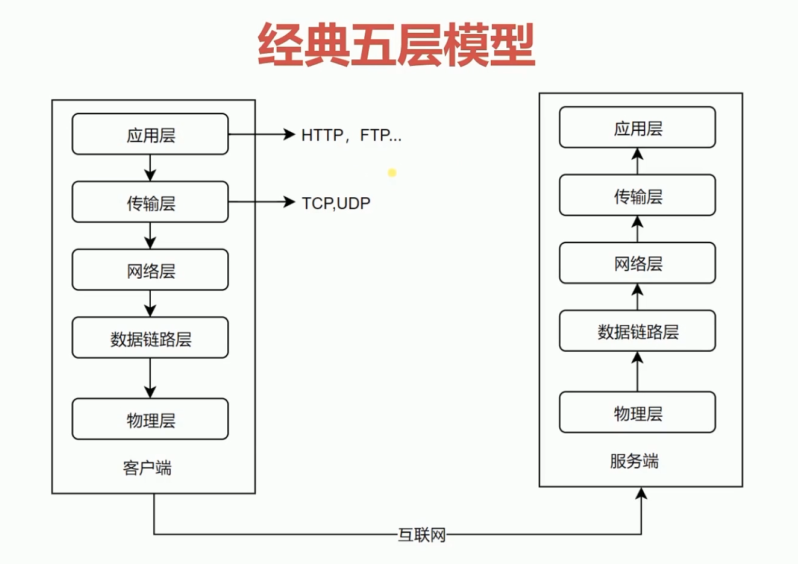

# 第2章-HTTP协议基础和发展历史

## 网络协议分层

**低三层**

* 物理层主要是定义物理设备如何传输数据
* 数据链路层在通信的实体间建立数据链路连接
* 网络层为数据在节点之间创建逻辑链路

**传输层**

* 向用户提供可靠的端到端（End-to-End）服务
* 传输层向高层屏蔽了下层数据通信的细节

**应用层**

* 为应用程序提供了很多服务
* 构建于TCP协议之上
* 屏蔽网络传输相关细节

