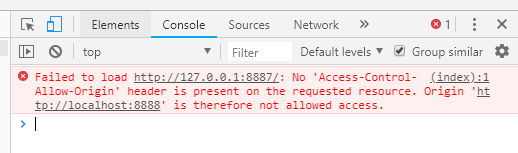
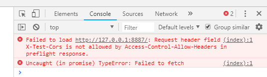

# 第3章-HTTP各种特性总览

## CORS跨域请求

**构造跨域问题（请求8888端口）**

server.js

```js
const http = require('http')
const fs = require('fs')

http.createServer(function (request, response) {
  console.log('request come', request.url)

  const html = fs.readFileSync('test.html', 'utf8')
  response.writeHead(200, {
    'Content-Type': 'text/html'
  })
  response.end(html)
}).listen(8888)

console.log('server listening on 8888')
```

test.html

```html
<!DOCTYPE html>
<html lang="en">
<head>
  <meta charset="UTF-8">
  <meta name="viewport" content="width=device-width, initial-scale=1.0">
  <meta http-equiv="X-UA-Compatible" content="ie=edge">
  <title>Document</title>
</head>
<body>
    
</body>
<!-- cors1 -->
<script>
  var xhr = new XMLHttpRequest()
  xhr.open('GET', 'http://127.0.0.1:8887/')
  xhr.send()
</script>
</html>
```

server2.js

```js
const http = require('http')

http.createServer(function (request, response) {
  console.log('request come', request.url)

  response.end('123')
}).listen(8887)

console.log('server listening on 8887')
```



**解决跨域问题**

更改server2.js

```js
const http = require('http')

http.createServer(function (request, response) {
  console.log('request come', request.url)

  response.writeHead(200, {
    'Access-Control-Allow-Origin': 'http://127.0.0.1:8888',
    'Access-Control-Allow-Headers': 'X-Test-Cors',
    'Access-Control-Allow-Methods': 'POST, PUT, DELETE',
    'Access-Control-Max-Age': '1000'
  })
  response.end('123')
}).listen(8887)

console.log('server listening on 8887')
```

或

更改test.html（允许标签跨域）

```js
<!DOCTYPE html>
<html lang="en">
<head>
  <meta charset="UTF-8">
  <meta name="viewport" content="width=device-width, initial-scale=1.0">
  <meta http-equiv="X-UA-Compatible" content="ie=edge">
  <title>Document</title>
</head>
<body>
    
</body>
<!-- cors1 -->
<script src="http:127.0.0.1:8887"></script>
</html>
```

## CORS预请求

**构造问题**

test.html

```html
<!DOCTYPE html>
<html lang="en">
<head>
  <meta charset="UTF-8">
  <meta name="viewport" content="width=device-width, initial-scale=1.0">
  <meta http-equiv="X-UA-Compatible" content="ie=edge">
  <title>Document</title>
</head>
<body>
</body>
<script>
  fetch('http://127.0.0.1:8887', {
    method: 'POST',
    headers: {
      'X-Test-Cors': '123'
    }
  })
</script>
</html>
```

server2.js

```js
const http = require('http')

http.createServer(function (request, response) {
  console.log('request come', request.url)
  response.writeHead(200, {
    'Access-Control-Allow-Origin': 'http://127.0.0.1:8888'
  })
  response.end('123')
}).listen(8887)

console.log('server listening on 8887')
```



**允许方法**

* GET
* HEAD
* POST

**允许Content-Type**

* text/plain
* multipart/form-data
* application/x-www-form-urlencoded

**其他限制**

* 请求头限制
* XMLHttpRequestUpload对象没有注册任何事件监听器
* 请求中没有使用ReadableStream对象

**解决问题**

修改server2.js

```js
const http = require('http')

http.createServer(function (request, response) {
  console.log('request come', request.url)

  response.writeHead(200, {
    'Access-Control-Allow-Origin': 'http://127.0.0.1:8888',
    'Access-Control-Allow-Headers': 'X-Test-Cors',
    'Access-Control-Allow-Methods': 'POST, PUT, DELETE',
    'Access-Control-Max-Age': '1000'
  })
  response.end('123')
}).listen(8887)

console.log('server listening on 8887')
```

## 缓存Cache-Control

**可缓存性**

* public。经过的节点都有缓存
* private。仅请求方有缓存
* no-cache。无缓存

**到期**

* max-age=<seconds>请求方生效
* s-maxage=<seconds>代理服务器上生效
* max-stale=<seconds>即使缓存过期仍使用过期缓存

**重新验证**

* must-revalidate
* proxy-revalidate

**其他**

* no-store

* no-transform

server.js

```js
const http = require('http')
const fs = require('fs')

http.createServer(function (request, response) {
  console.log('request come', request.url)

  if (request.url === '/') {
    const html = fs.readFileSync('test.html', 'utf8')
    response.writeHead(200, {
      'Content-Type': 'text/html'
    })
    response.end(html)
  }

  if (request.url === '/script.js') {
    response.writeHead(200, {
      'Content-Type': 'text/javascript',
      'Cache-Control': 'max-age=20'
    })
    response.end('console.log("script loaded")')
  }
}).listen(8888)

console.log('server listening on 8888')
```

test.html

```html
<!DOCTYPE html>
<html lang="en">
<head>
  <meta charset="UTF-8">
  <meta name="viewport" content="width=device-width, initial-scale=1.0">
  <meta http-equiv="X-UA-Compatible" content="ie=edge">
  <title>Document</title>
</head>
<body>
    
</body>
<script src="/script.js"></script>
</html>
```

